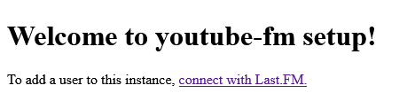

# youtube-fm
A bridge between YouTube Music and Last.FM.

I have found [exactly one](https://ytmusicapi.readthedocs.io/en/latest/index.html)
YouTube Music API.  It is written in Python and is relatively limited, and that
reflects on this project as well.  Additionally, there are two maintained Python
Last.FM APIs: [`pylast`](https://github.com/pylast/pylast), which relies on an
MD5-hashed user password, and [`lastpy`](https://github.com/huberf/lastfm-scrobbler),
which is a bit clunky and doesn't support custom timestamps
([yet](https://github.com/huberf/lastfm-scrobbler/pull/3)).  Currently we're rolling
our own Last.FM integration based on `lastpy`.

## Limitations
This project works around limitations from YouTube Music in a few ways:
1. **The API does not include a subscription for playback events.**  We pull the
   playback history and backtrack to the last played track, then submit scrobbles for
   each of those tracks.
2. **The History list (on Google's side) does not allow duplicates.**  This means we
   cannot count how many times a song was looped, and causes more problems since...
3. **The API does not include playback timestammps.**  When pulling the history, we
   rely on the last playback ID found as a bookmark.  This is unreliable and has many
   edge cases:
   - We can't tell if a track has been played in a loop with other tracks.  A playlist
     with songs A, B, and C will only show those three tracks no matter how many times
     it's looped.
   - Rolling back to the last played track is Hard™.  We store the track ID (YouTube
     video slug) of the last track we found and cut the history there.  So if you
     played 500 tracks between now and the last run, if you ended with the same one
     you ended with last time, we'll find zero.
   - Timestamps are impossible and complete guesswork.  Currently we grab the current
     timestamp when running the pull and assume you started the current track at that
     time, then backtrack that through all tracks in history by length.  So if the
     track you played before this one is three minutes long, we'll assume you played
     it three minutes ago.  It's absolutely imperfect and makes tons of assumptions,
     but it's better than submitting them as all played simultaneously.
   - Playback duration is impossible to track.  Most Last.FM scrobblers let you define
     a minimum playback duration, but since we cannot track start/stop times we will
     always assume it was played in full.  Again, very imperfect, but not much we can
     do about it without more API info.

## Setup and Use
With these limitations in mind, the intended use is a bit interesting: *run the script
frequently.*  Good idea to have a sane limit (haven't load tested anything yet) of
maybe 5-10 minutes, but probably not longer than once an hour.  Unless you're skipping
through vast amounts of unique songs, you're unlikely to hit the Last.FM API limit,
but considering that the YouTube Music API relies on browser cookies it's probably a
good idea not to overdrive that, lest your actual YouTube account get flagged.

Speaking of cookies, let's set this up:
1. Clone the project:
   ```bash
   $ git clone https://github.com/ndm13/youtube-fm.git
   ```
2. Ensure the `LASTFM_API` and `LASTFM_SECRET` environment variables contain your API key and secret, respectively.
   You should also set the `SECRET_KEY` now as this will be used to encrypt values in the database.
3. Start the web server:
   ```bash
   $ python server.py
    * Serving Flask app 'server'
    * Debug mode: off
   INFO:werkzeug:WARNING: This is a development server. Do not use it in a production deployment. Use a production WSGI server instead.
    * Running on http://127.0.0.1:5000
   INFO:werkzeug:Press CTRL+C to quit
   ```
4. Navigate to the URL shown to begin setup.  You should see a message like this:
   
   Click the link - it's already configured with your API key and will redirect to the running server.  On the new page,
   click the Authorize button to return to the server.
5. You should be returned to a screen like this:
   
   Follow the steps in the linked guide to get the necessary headers for YouTube Music, then paste those headers in the
   text area and click Submit.
6. You should see a notice that cookies were successfully saved:
   
   Click the button to configure the user, or close to accept the default values.
7. To scrape YouTube Music and scrobble the tracks to Last.FM, run the main script:
   ```bash
   $ python main.py
   INFO:root:Connecting to database
   INFO:root:Started run, pulling users
   INFO:root:Running update for user <user> (<uuid>)
   INFO:root:Scrobbling 'Everybody Likes You' by Lemon Demon
   INFO:root:Writing ID 4xElp-lYnyE as new last
   ```
   This will run the script for all users whose last run was longer ago than their chosen interval.  The default
   interval is `3000` seconds (every five minutes).  The more often `main.py` runs, the closer the user's individual
   runs will be to their requested interval, but that means more load placed on both the Last.FM and YouTube Music APIs.
   Be wary of rate limits/bans!

P.S: The default log level is `INFO`.  You can change it by setting the environment variable `LOG_LEVEL` per the Python
logging spec.

## Future Improvements
This is the minimum product I'm comfortable releasing after a long night of relearning
Python.  There are some definite quality of life improvements to be made:
- [x] ~~**HTTP server:**~~

  Currently using Flask to handle Last.FM callback and user configuration.
- [x] ~~**A database:**~~

  Currently using Sqlite3 with a user-provided `SECRET_KEY` encrypting the user tokens/cookies.
- [ ] **Docker container:**

  Because Docker makes everything better.  Preferably not just the `main.py`, but a `cron`
  job or some other automation to run at *n* interval.
- [ ] **Clean up this UI:**

  It's so ugly.  Like, actually.  I literally threw this together for a proof of concept.
- [ ] **Wait for YouTube Music API to get better:**

  Either the unofficial version or (hopefully) an official version with the necessary
  features.
- [ ] **An automation to capture cookies:**

  This is the highest bar for casual adoption. Not sure how to solve this, but I know
  there are already extensions that do this for YouTube-DL-type services.  Needs
  investigation, may be able to repurpose an existing extension.
- [ ] **Python is not my language of choice:**

  If you see something wrong from a style or convention perspective let me know!  I'd love
  to get this ported to Deno or something like that, but I want to keep support for the
  *only* existing YouTube Music API for now so it's going to stay Python for the time
  being.
